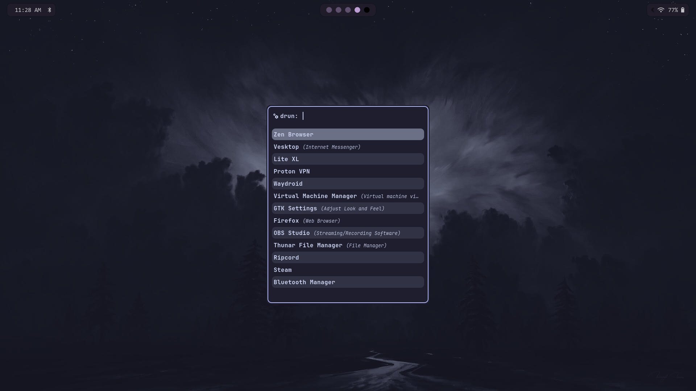
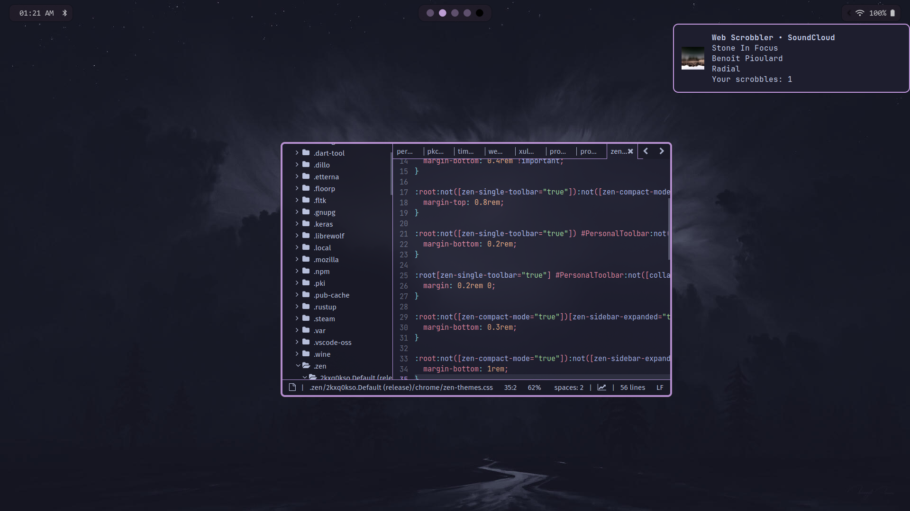
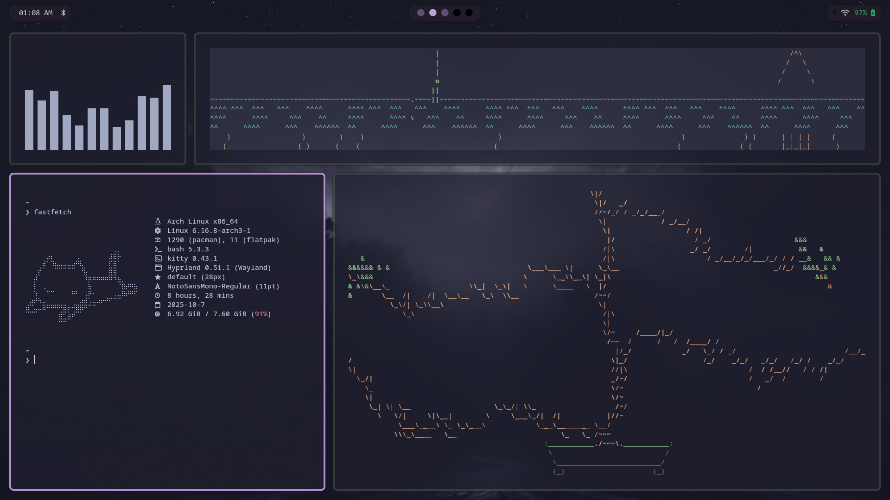

# 🌊 Hyprland Dotfiles

<div align="center">

```
╦ ╦╦ ╦╔═╗╦═╗╦  ╔═╗╔╗╔╔╦╗  ╔═╗╔═╗╔╦╗╦ ╦╔═╗
╠═╣╚╦╝╠═╝╠╦╝║  ╠═╣║║║ ║║  ╚═╗║╣  ║ ║ ║╠═╝
╩ ╩ ╩ ╩  ╩╚═╩═╝╩ ╩╝╚╝═╩╝  ╚═╝╚═╝ ╩ ╚═╝╩  
```


**A little look at my workflow wouldn't hurt now, would it?**
<br>

[](#-the-setup)
[](#-installation)
[](#-custom-scripts)
[](#-keybindings)
[](#-gallery)


</div>

---

## 🎭 The Philosophy

<table>
<tr>
<td width="50%">

### Why This Setup?

```yaml
Living Colors:
  - Wallpaper dictates everything
  - Auto-generated color schemes using PYWAL
  - Consistent across all apps

Performance:
  - Wayland native
  - GPU accelerated
  - Butter smooth animations

Philosophy:
  - Minimal but complete
  - Beautiful and functional
  - Actually daily-drivable
```

</td>
<td width="50%">

### Built for
<br>

```yaml
Developers who live in the terminal.
Designers who appreciate aesthetics.
Power users who demand efficiency.
Tinkerers who love customization.
Anyone tired of boring desktops.
Minimalists seeking a clean workspace.
Laptop users relying on trackpad gestures.
Students who require deep focus.
Multitaskers using multiple monitors.
Newcomers to tiling window managers.
Creators needing a beautiful, light desktop for streams.
```
<br>
</td>
</tr>
</table>


## 🌟 Gallery

<div align="center">

### Launcher • Editor • Eye Candies

<br>





<br>

<br>

[](https://github.com/vestirae/vidots/tree/main/Screenshots)

</div>


## 🧩 The Setup

<div align="center">

### Core Components

<div align="center">

<table>
<tr>
<td width="50%" valign="top">

### Core Experience

| Component       | Description              |
| --------------- | ------------------------ |
| **Kitty**       | GPU-accelerated terminal |
| **Bash**        | Reliable shell           |
| **Waybar**      | Customizable status bar  |
| **Rofi**        | Application launcher     |
| **Mako**        | Notification daemon      |
| **Zen Browser** | Calm browsing            |
| **Thunar**      | Lightweight file manager |
| **Lite-XL**     | Code editor              |

</td>
<td width="50%" valign="top">

### Visual Magic

| Component             | Description             |
| --------------------- | ----------------------- |
| **Hyprpaper**         | Wallpaper engine        |
| **Pywal**             | Automatic color theming |
| **Hyprlock**          | Beautiful screen lock   |
| **Hypridle**          | Idle management         |
| **Grimblast**         | Screenshot utility      |
| **Hyprshot**          | Advanced screenshots    |
| **libinput-gestures** | Touchpad gestures       |
| **GTK Theme**         | Catppuccin for the win! |

</td>
</tr>
</table>

</div>


<div align="center">

<br>

### Terminal Toys

*Because life's too short for boring terminals*

| Tool             | Purpose                                       |
| ---------------- | --------------------------------------------- |
| **fastfetch**    | System info that looks cool!                  |
| **cava**         | Audio visualizer - see your music dance~      |
| **asciiquarium** | Watch the fish swim...                        |
| **cbonsai**      | Grow a bonsai tree while you contemplate life |


</div>


<div align="center">
<br>

### Tools & Utilities

<table>
<tr>
<td align="center" width="33%" valign="top">


**Package Management**

Paru — AUR Helper
<br>
pacman-contrib — Extra tools

</td>
<td align="center" width="34%" valign="top">


**Font Stack**

JetBrains Mono
CodeNewRoman Nerd
Noto Fonts + Emoji
Liberation Fonts

</td>
<td align="center" width="33%" valign="top">


**Dependencies**

All the good stuff you need
for a smooth experience

</td>
</tr>
</table>

</div>
<br>


<div align="left">

## 🎨 Custom Scripts
</div>

<div align="center">

[](./Scripts)

*These magic scripts live in `~/Scripts/` and power your workflow*

<table>
<tr>
<td width="50%" valign="top">

### Script 1: `[picker.sh]`

```
Pick hex codes.
```

**Keybind:** `CTRL + SPACE`

---

### Script 2: `[rofitog.sh]`

```
Toggles rofi (duh).
```

**Keybind:** `ALT + SPACE`

</td>
<td width="50%" valign="top">

### Script 3: `[volume.sh]`

```
Volume changes with mako.
```

**Keybind:** `Volume Modifiers`

---

### Script 4: `[rotate.sh]`

```
Rotates screen.
```

**Keybind:** `CTRL + SHIFT + ~`

</td>
</tr>
</table>

**Pro Tip:** Make scripts executable with
 `chmod +x ~/Scripts/*.sh`
</div>


<br>

<div align="left">


## 🚀 Installation
</div>


### Prerequisites

<table>
<tr>
<td align="left" valign="top">

**What You Need**
- Arch Linux (btw)
- Internet connection
- Basic terminal knowledge
- Sense of adventure

</td>
<td align="left" valign="top">

**Before You Start**
- Backup your current configs  
- Read the installation script  
- Have your wallpaper ready  
- Prepare for awesomeness  

</td>
</tr>
</table>

<br>
 
### Installation Command

```bash
# Clone this beauty
git clone https://github.com/vestirae/vidots ~/.dotfiles && cd ~/.dotfiles

# Install paru if you haven't already
if ! command -v paru &> /dev/null; then
    sudo pacman -S --needed base-devel git
    git clone https://aur.archlinux.org/paru.git /tmp/paru
    cd /tmp/paru && makepkg -si && cd -
fi

# Install everything
paru -S --needed \
    hyprland hyprpaper hypridle hyprlock \
    kitty waybar rofi mako thunar \
    zen-browser-bin lite-xl \
    python-pywal fastfetch cava asciiquarium cbonsai \
    grimblast-git hyprshot libinput-gestures \
    ttf-jetbrains-mono otf-codenewroman-nerd \
    noto-fonts noto-fonts-emoji ttf-liberation \
    pacman-contrib

# Backup your old configs (just in case)
mkdir -p ~/.config/backup-$(date +%Y%m%d)
for dir in hypr kitty waybar rofi mako; do
    [ -d ~/.config/$dir ] && cp -r ~/.config/$dir ~/.config/backup-$(date +%Y%m%d)/
done

# Deploy configs
cp -r .config/* ~/.config/
cp -r Scripts ~/Scripts

# Make scripts executable
chmod +x ~/Scripts/*.sh

# Set up gestures
sudo gpasswd -a $USER input
libinput-gestures-setup autostart
libinput-gestures-setup start

echo "🎉 Installation complete! Reboot or logout and log back in."
```
<br>
 
### First Boot Checklist

| Step | Action |
|------|--------|
| **1. Set Your Wallpaper** | `wal -i ~/path/to/wallpaper.jpg` |
| **2. Launch Hyprland** | Login and select Hyprland |
| **3. Test Everything** | Try your keybinds and run your scripts |
| **4. Flex on r/unixporn** | Take screenshots and post with pride |


<div align="left">

## ⚡ Keybindings

</div>
<div align="center">


### Master Your Workflow
(*All keybinds use `CTRL` key as the modifier*)

</div>
<br>
 
### Launch Applications

| Keybind | Action |
|---------|--------|
| `CTRL + ALT + T` | Launch Terminal (Kitty) |
| `ALT + SPACE` | Application Launcher (Rofi) |
| `CTRL + E` | File Manager (Thunar) |
| `CTRL + SHIFT + Z` | Web Browser (Zen) |
| `Super + L` | Lock Screen (Hyprlock) |
<br>
 
### Window Management

| Keybind | Action |
|---------|--------|
| `CTRL + Q` | Close Active Window |
| `ALT + F` | Toggle Fullscreen |
| `Super + V` | Toggle Floating |
| `Super + P` | Toggle Pseudo Tile |
| `Super + J` | Toggle Split Direction |
| `ALT + TAB` | Move focus |
| `CTRL + SHIFT + ArrowKeys` | Resize Window (Direction-dependent) |
<br>
 
### Workspace Navigation

| Keybind | Action |
|---------|--------|
| `ALT + 1-9` | Switch to Workspace 1-9 |
| `Super + Shift + 1-9` | Move Window to Workspace |
| `CTRL + ALT + Left/RightArrow` | Move to the left/right workspace |
<br>
 
### Screenshots

| Keybind | Action |
|---------|--------|
| `ALT + FM + Insert` | Screenshot Full Screen |
| `Super + Shift + S` | Freeze and Screenshot |

<br>
 
### Custom Script Keybinds

| Keybind | Script | Action |
|---------|--------|--------|
| `Super + ?` | `script1.sh` | Script 1 |
| `Super + ?` | `script2.sh` | Script 2 |
| `Super + ?` | `script3.sh` | Script 3 |
| `Super + ?` | `script4.sh` | Script 4 |


<div align="left">

## 🎨 Making It Yours
</div>

### Change Theme Colors

```bash
# From an image
wal -i ~/Pictures/wallpaper.jpg

# From a preset theme
wal --theme base16-monokai

# Reload current theme
wal -R
```

**Tip:** Place wallpapers in `~/.config/hypr/wallpapers/` for easy access!

<br>

### Tweak Hyprland

**Main Config:** `~/.config/hypr/hyprland.conf`


Customize everything:
```
 Window rules
 Animations
 Keybinds
 Workspace behavior
 Border styles
```

The [Hyprland Wiki](https://wiki.hyprland.org) is your best friend.
</div>


<br>

<div align="left">

## 🔧 Troubleshooting
</div>

<details>
<summary><b>Waybar not appearing?</b></summary>

<br>

```bash
# Kill and restart Waybar
killall waybar
waybar &

# Check for errors
waybar -l debug
```

Make sure Waybar is in your Hyprland autostart: `~/.config/hypr/hyprland.conf`

</details>

<details>
<summary><b>Pywal colors not applying?</b></summary>

<br>

```bash
# Restore last color scheme
wal -R

# Generate from wallpaper again
wal -i ~/path/to/wallpaper.jpg

# Check if pywal cache exists
ls ~/.cache/wal/
```

Restart affected applications for colors to take effect.

</details>

<details>
<summary><b>Scripts not executing?</b></summary>

<br>

```bash
# Make them executable
chmod +x ~/Scripts/*.sh

# Test the script manually
~/Scripts/your-script.sh

# Check if path is correct in hyprland.conf
cat ~/.config/hypr/hyprland.conf | grep Scripts
```

Ensure scripts have proper shebang: `#!/bin/bash`

</details>

<details>
<summary><b>Hyprland crashes on start?</b></summary>

<br>

```bash
# Check the logs
cat /tmp/hypr/$(ls -t /tmp/hypr/ | head -n 1)/hyprland.log

# Try starting with default config
mv ~/.config/hypr/hyprland.conf ~/.config/hypr/hyprland.conf.backup
Hyprland

# Start from TTY (Ctrl+Alt+F2)
```

Common issues: missing dependencies, syntax errors in config, driver problems.

</details>

<details>
<summary><b>Gestures not working?</b></summary>

<br>

```bash
# Check if you're in the input group
groups | grep input

# Add yourself to the group
sudo gpasswd -a $USER input

# Logout and back in, then check status
libinput-gestures-setup status

# Start the service
libinput-gestures-setup start
```

Make sure `libinput-gestures` config is in `~/.config/libinput-gestures.conf`

</details>

<details>
<summary><b>Screenshots not saving?</b></summary>

<br>

```bash
# Create screenshots directory
mkdir -p ~/Pictures/Screenshots

# Check grimblast and hyprshot installations (both of them should return something like /usr/bin/grimblast and /usr/bin/hyprshot if installed correctly)
which grimblast hyprshot

# Test screenshot manually
grimblast save area ~/Pictures/test.png
```

Verify the save path in your screenshot scripts.

</details>


<br>

<div align="left">

## 🤝 Contributing
</div>

<div align="center">

[](https://github.com/vestirae/vidots/pulls)
[](https://github.com/vestirae/vidots/issues)

</div>

Found a bug? Have a cool script? Want to add features? PRs are welcome!

### Ways to Contribute

- Report bugs and issues
- Suggest new features or improvements  
- Share your custom scripts
- Submit screenshots to the gallery
- Improve documentation
- Star the repo if you like it

<br>

<div align="left">

## 💖 Credits
</div>

Massive thanks to:
- **The Hyprland Team** - For creating this amazing compositor
- **Vaxry** - Lead developer of Hyprland
- **The Arch Linux Community** - For existing and being awesome
- **r/unixporn** - Endless inspiration and motivation
- **Pywal Contributors** - For the magic color generation
- **You** - For checking out this setup!

<br>

<div align="left">

## 📜 License

</div>
<div align="center">

[](https://opensource.org/licenses/MIT)
[](https://github.com/vestirae/vidots)

**MIT License** - Do whatever you want with this!

Copy it, break it, improve it, share it. Just have fun!

</div>
